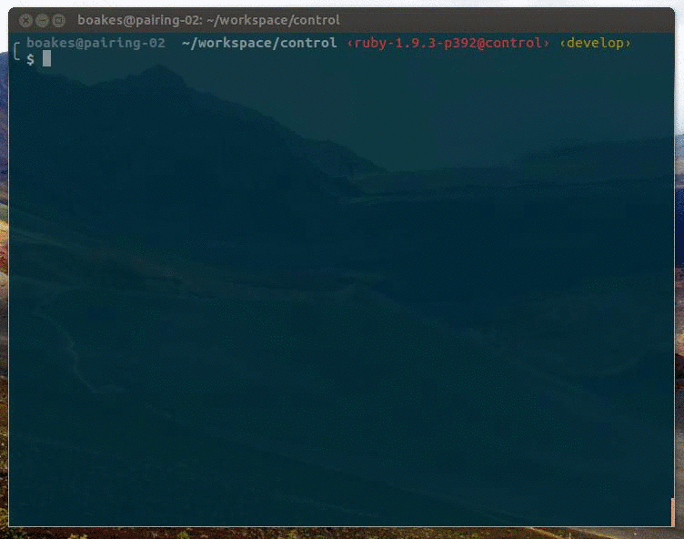

# Fast Specs

Benjamin Oakes

benjaminoakes.com

continuity.net

---

Goal of this talk:

## Faster, more enjoyable Test Driven Development in our Rails apps

---

# The problem

---

## Rails specs are slow!

And as the code ages, specs get slower and slower...

Right now, it's an exception that a Rails app has fast specs

---

## When we develop...

Ideally, we do Test Driven Development (TDD)

### Steps

design

test, implement, test, implement...

maybe: redesign

maybe: test, implement, test, implement...

maybe: refactor

---

### lots of test/implement cycles

### ==

### lots of waiting

---

### Wouldn't it be nice if specs ran like this, instead?

---

# Example

---

Let's say we have this feature to work on...

## Feature: Show some basic stats in a table

---

## Some options

* **View layer:** Do the logic in the view
* **Model layer:** Add more methods to the model, use in the view
* **Elsewhere:** Add some business object, use in the view

---

Let's go with "elsewhere"

`class StatsPresenter`

---

Why should this take more than *1 second* to run?

<pre><code class="language-ruby">class StatsPresenter
  def initialize(model)
    @model = model
  end

  def percentage
    @model.part.to_f / @model.total.to_f # ...
  end
end
</code></pre>

<pre><code class="language-ruby">require 'spec_helper'

describe StatsPresenter do
  # ...
  it 'has a percentage' do
    # ...
    presenter.percentage.should == '42.00%'
  end
end
</code></pre>

---

In our Rails test suite

## running just this spec takes 30+ seconds

---

## 6 test/implement cycles * 30 secs each = 3 minutes

A SyntaxError could ruin your concentration a full minute (looking at Twitter, etc)

---

## So what's the cause?

---

## Is it Ruby?

Ruby is slow, right?

Well, Ruby itself is pretty fast

(Spork, Specjour, etc. are just band aids)

---

## Is it Rails?

It's certainly a big part of the issue

---

## For instant gratification

We had made other changes for Rails in the past

* Upgraded to Ruby 1.9.3
* Changed from fixtures/`FactoryGirl.create` to `FactoryGirl.build` when possible
* Changed our database cleaner (truncation vs transactions)
* Removed unnecessary setup, etc
* Avoided `before(:all)`
* etc

---

But for pure, simple Ruby within a Rails app, this is

## the smoking gun

`require 'spec_helper'`

---

`spec_helper` loads 

## our entire universe

including dependencies -- just to test a single unit!

Our spec doesn't need most of that.

Changing this line gets us *subsecond* specs!

---

For instant specs

## We need better design

*Stupider* views

*Slimmer* models

Better use of delegation, business objects, design patterns, etc

(Our `StatsPresenter` qualifies for this)

---

This has been discussed before, especially by

## Corey Haines

He advocates for a `spec_no_rails` directory

---

But we didn't want to disturb

## the Rails ecosystem

naming conventions

Rails.vim

etc

---

### Can we have the best of Both Worlds?

# Yes

Our twist on ideas from Corey Haines, [Lar Van Der Jagt](http://www.supaspoida.com/2011/10/16/how-i-fast-test-rails.html), and [Les Hill](https://github.com/leshill/fast_specs/blob/master/fast_specs/fast_spec_helper.rb)

---

We added

## An alternative spec helper

`spec/fast_spec_helper.rb`

    %w(helpers models presenters).each do |dir|
      $LOAD_PATH.push File.expand_path("../../app/#{dir}", __FILE__)
    end
    
    require 'ostruct'
    require 'active_support/core_ext'
    
    # [...]
    #
    # Helper methods for
    #
    # * modules
    # * using OpenStruct and Struct as value objects

---

If your code doesn't require the entire universe

## just change the require

Old:

<pre><code class="language-ruby">require 'spec_helper'
</code></pre>

New:

<pre><code class="language-ruby">require 'fast_spec_helper'
# [...] other specific requires as necessary
</code></pre>

---

Now running single specs via `rspec` or `guard` is fast

## and TTD is fun again

---

We've found that fast specs are best

## when adding new code

Ideally, we should

* Treat Rails as a dependency, not our app
* Use ActiveRecord models for persistance and queries, not business logic
* Avoid requiring the entire universe

(For old code, see "instant gratification")

---

## Can everything be fast?

Unfortunately not.

But more of what we write can be.

It's a state of mind, not an end goal.

---

## Thanks!

@benjaminoakes

benjaminoakes.com

continuity.net

---

# Demo

`script/fast_spec`

    #!/bin/bash
    rspec `grep -rl fast_spec_helper spec`

---

---

## From the cutting room floor...

---

Using multiple techniques, we've

## significantly reduced the running time

of our entire test suite (60% of what it was before)

Age of codebase: 4 years

---

## Specs are a tool

Listen to your specs for feedback (Test Driven Design).

If they're running slow, maybe something's wrong with the design...

---

We can't constantly be waiting 30+ seconds just to see whether our spec failed or passed.

If they're painful, we won't write them (or run them) anymore.
